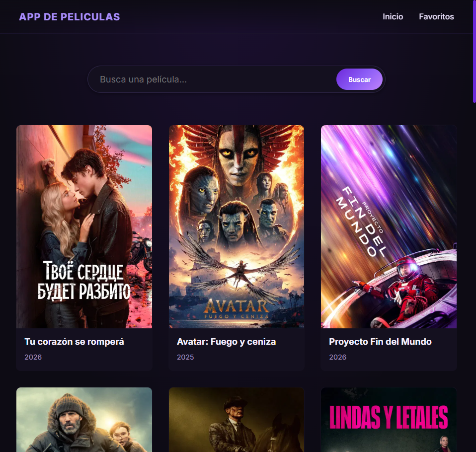
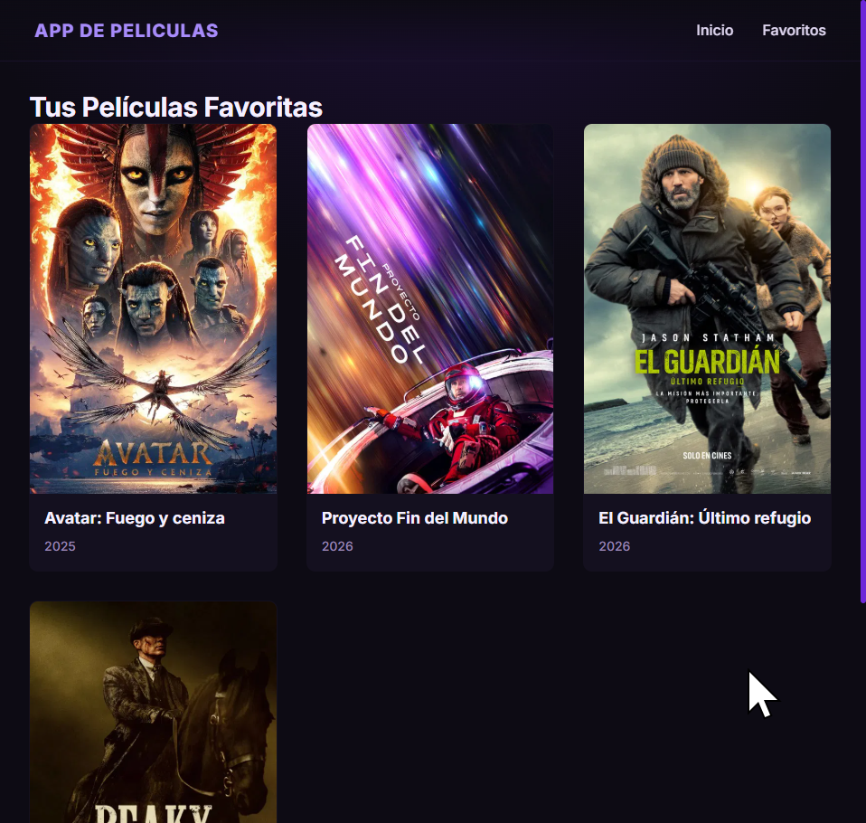

# MovieBox 🎬 - Catálogo de Películas con React

Una plataforma moderna de búsqueda y gestión de películas desarrollada con **React 18** y **Vite**. La aplicación permite a los usuarios explorar películas populares, buscar títulos específicos y gestionar una lista persistente de favoritos.

---

## 📸 Vista Previa

| Página Principal | Sección de Favoritos |
| :--- | :--- |
|  |  |

---

## 🛠️ Stack Tecnológico

- **Core**: [React 18+](https://react.dev/)
- **Build Tool**: [Vite](https://vitejs.dev/)
- **Routing**: [React Router DOM v6](https://reactrouter.com/)
- **State Management**: [React Context API](https://react.dev/learn/passing-data-deeply-with-context)
- **Persistencia**: [LocalStorage API](https://developer.mozilla.org/en-US/docs/Web/API/Window/localStorage)
- **Styling**: Vanilla CSS con Variables Modernas y Glassmorphism.

---

## 🚀 Características Técnicas

### 1. Gestión de Estado Global (Context API)

Utiliza un `MovieProvider` centralizado para manejar el estado de las películas favoritas en toda la aplicación, evitando el "prop drilling" y asegurando una sincronización inmediata entre vistas.

### 2. Persistencia de Datos

Los favoritos del usuario se sincronizan automáticamente con el `localStorage` del navegador mediante `useEffect`, permitiendo que la selección se mantenga tras recargar la página.

### 3. Integración de API Asíncrona

Implementa un patrón de servicios para separar la lógica de negocio de la interfaz de usuario, manejando peticiones `fetch` con bloques `try/catch` y estados de carga (`loading`/`error`).

### 4. Diseño Responsive y Moderno

Interfaz de usuario pulida con:

- **Glassmorphism**: Efectos de desenfoque y transparencia en botones y modales.
- **CSS Variables**: Sistema de diseño basado en tokens para facilitar el mantenimiento.
- **Micro-animaciones**: Transiciones suaves al interactuar con las tarjetas de películas.

---

## 📁 Estructura del Proyecto

```bash
src/
├── assets/          # Recursos estáticos (imágenes, logos)
├── components/      # Componentes reutilizables (NavBar, TarjetaPelicula)
├── contexts/        # Lógica de Context API (ContextoPeliculas.jsx)
├── css/             # Hojas de estilo modulares
├── pages/           # Vistas principales (Home.jsx, Favorites.jsx)
└── servicios/       # Capa de servicios y llamadas a API
```

---

## 🔧 Instalación y Desarrollo

1. **Clonar el repositorio**:

   ```bash
   git clone <url-del-repo>
   ```

2. **Instalar dependencias**:

   ```bash
   npm install
   ```

3. **Iniciar servidor de desarrollo**:

   ```bash
   npm run dev
   ```

4. **Construir para producción**:

   ```bash
   npm run build
   ```

---

<p align="center">
  <i>Hecho por @rodsterm</i>
</p>
